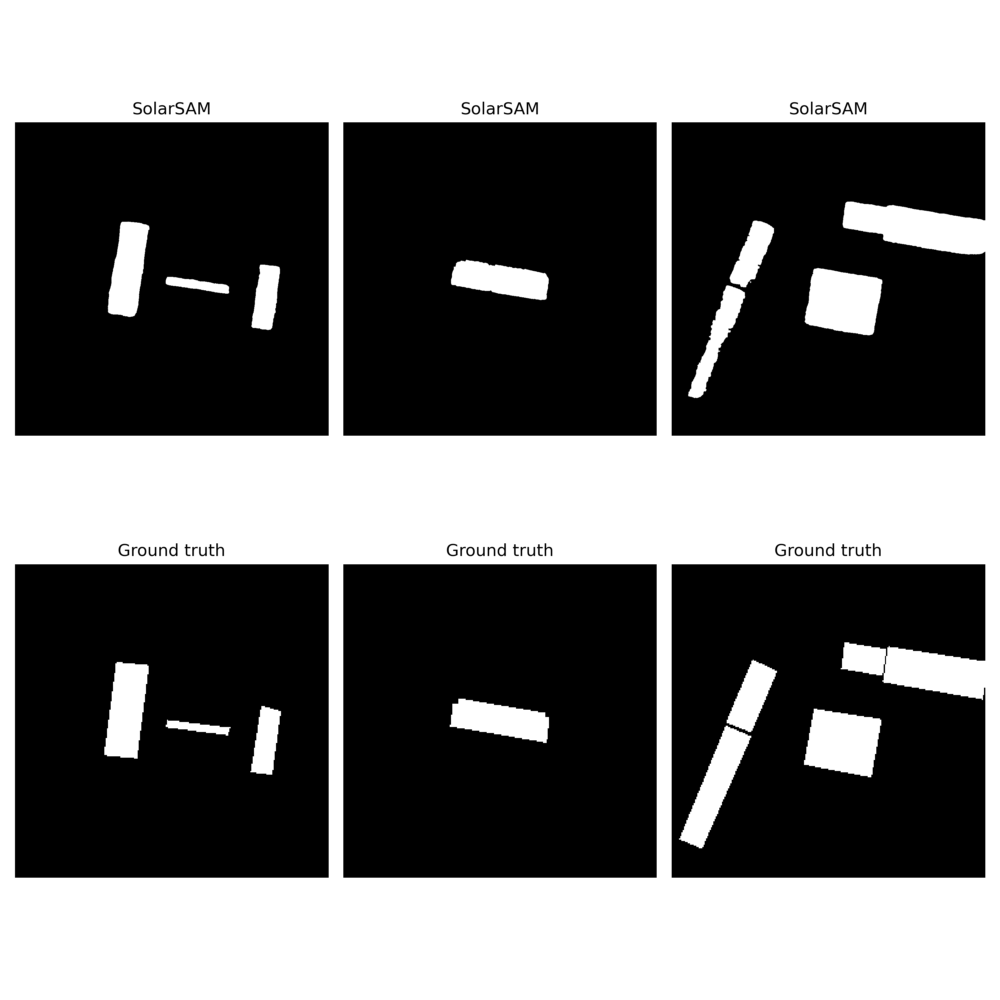
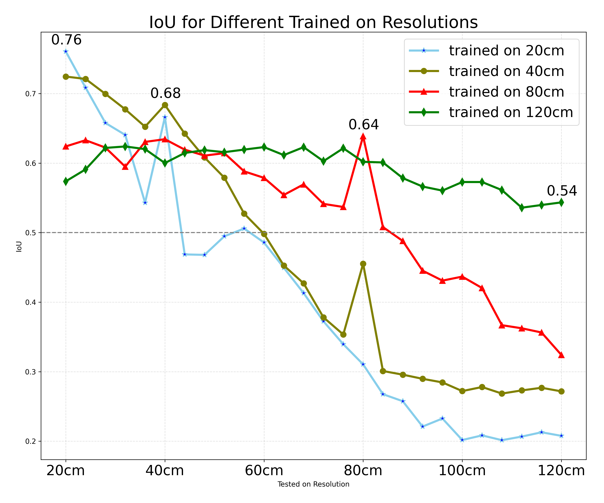

# SolarSAM - Deep Learning for PV Systems Detection 


## Resolution-Detection Trade-Off


# Prerequisites
```bash
Aerial Imagery with .TIF Extension 
```
```bash
Geometry Masks in .geojson Format 
```
```bash
SAM Model Checkpoint downloaded from https://dl.fbaipublicfiles.com/segment_anything/sam_vit_b_01ec64.pth
```
```bash
Put the downloaded checkpoint into pretrained/ folder
```
# Preprocessing - Creating *Train, Validation and Testing* Datasets
```bash
Go to preproccessing Folder and Create python environment using requirements.txt (Preprocessing uses different set of packages than trainig and must be done only once) 
```
```bash
After Activating the newly created Environment run: 
python run --tif-folder $ABSOLUTE_PATH_TO_WHERE_TIF_IMAGES_RESIDE --geojson-folder $ABSOLUTE_PATH_WHERE_GEOMETRY_MASKS_RESIDE
```
```bash
This will create and put resutls into ./temp folder
copy load folder from ./temp and put it into the root workspace path
load folder contains everython you need for training, validation, and testing 
```
# Training:
```bash
Go to workspace Folder and Create python environment using requirements.txt
Activate that workspace and run:
```
```bash
torchrun train.py --config configs/sam-vit-b.yaml
```
# Testing:
```bash
python test.py --model $ABSOLUTE_PATH_TO_THE_TRAINED_MODEL ----dataset ('val_dataset'|'test_dataset')
```